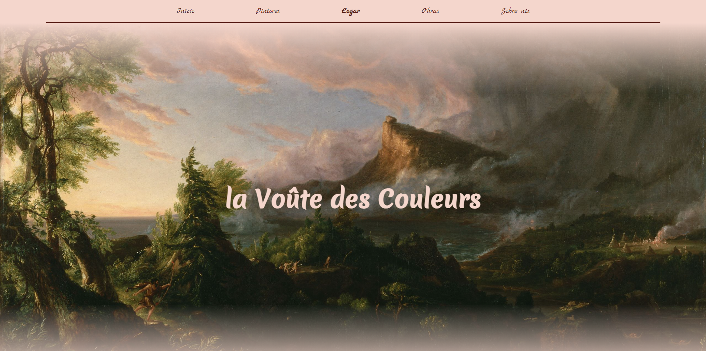

<h1 align="center"> la Voûte des Couleurs </h1>

    

# Sobre o Projeto

Projeto de capacitação em React e Ruby on Rails criado pela Diretoria Administrativa - Financeira da Struct e concluído em 17 de agosto de 2021. Essa capacitação ocorreu devido a transição no uso de Rails Full-Stack para o uso da biblioteca React (front-end) em conjunto com Ruby on Rails (back-end).

La Voûte des Couleurs é uma galeria digital com inúmeros artistas e pinturas de altíssima qualidade. O site conta também com conteúdos educativos referentes às pinturas, aos estilos e aos seus artistas. Para a inclusão ou remoção de conteúdo visual das páginas, o site possui uma página de Login e Logout para acesso do administrador.

Para acessar o site completo será necessário fazer uso da api em Rails localizada em [Capacitacao-Projetos-Api
](https://github.com/StructCE/Capacitacao-Projetos-Api). 

## Membros responsáveis pelo projeto:
* [Arthur Mota Furtado](https://github.com/BomDia12)
* [Guilherme Rodrigues](https://github.com/guilodron)
* [Iago Carvalho](https://github.com/carvalhoiago)
* [Kayran Vieira](https://github.com/DraculK)

# Requisitos e ferramentas utilizadas
* [Node](https://nodejs.org/en/download/) (v16.16.0)
* [Yarn](https://classic.yarnpkg.com/lang/en/docs/install/#windows-stable)
* [Git](https://git-scm.com/downloads)

# Como clonar e rodar o projeto em sua máquina
### `git clone https://github.com/StructCE/Capacitacao-Projetos-Front.git`
Clona o repositório para uso local em seu computador.

### `yarn` ou `yarn install`
Instala todas as dependências e módulos do arquivo package.json necessários para o rodar o projeto react.

Caso o erro `ERR_OSSL_EVP_UNSUPPORTED webpack` surja, a sua versão do node pode ser diferente da versão do projeto. Nesse caso digite no terminal `nvm use 16.16.0` e tente instalar as dependências novamente.

### `yarn start`
Roda o projeto em modo de desenvolvedor.

Abra [http://localhost:2000](http://localhost:2000) para visualizar o projeto em seu navegador padrão.

A página vai recarregar se você fizer qualquer edição e erros no código serão exibidos no terminal.

